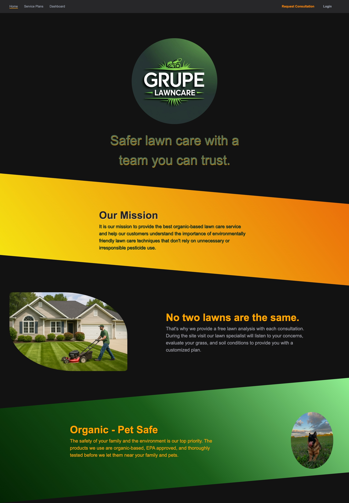
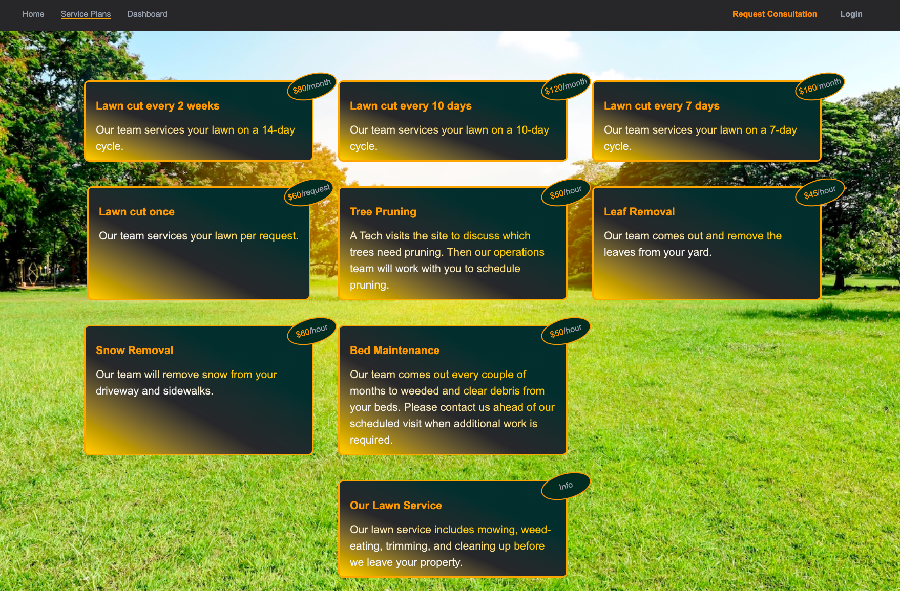
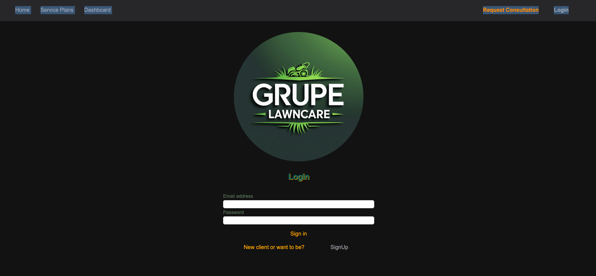
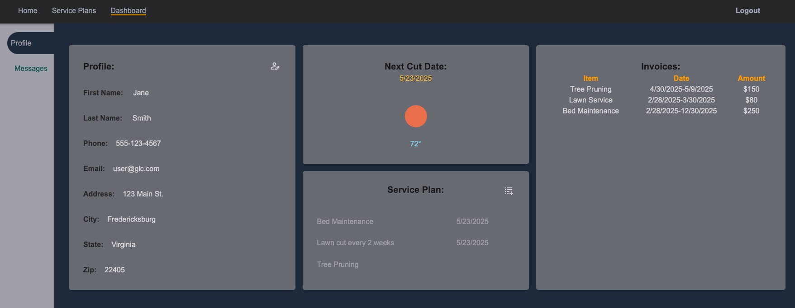
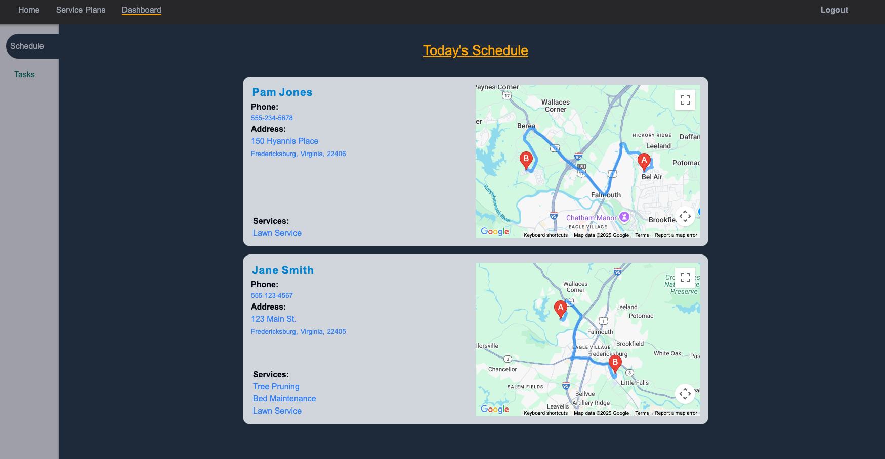
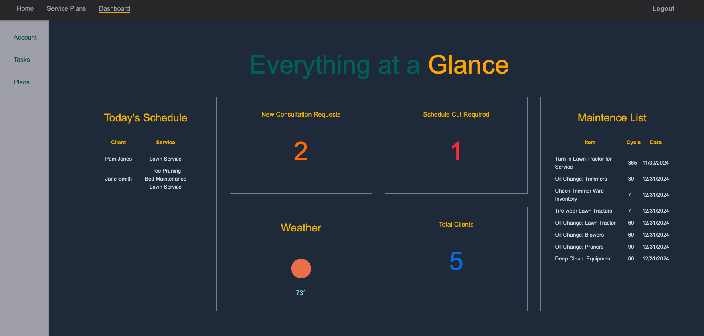

# Welcome to Grupe Lawn Care
This app is for lawn care companies wanting to eliminate customer pain points by moving to a self service type model. 

I built this app around three personas.
- Operations
- Technicians
- Clients

### Benefits
- The application allows operations to oversee all aspects of the business.
- Individual daily schedules are provide to each technician when they login including Google Map directions to each client.
- The clients are able to update their user information, change, add services.  They can see their next cut date and what the weather is on that day.  Once they've requested a change that request will be visible in their message center.

## Home Page
Here you get the overall idea of the company and the products we use.

## Service Plan Page
This is a list of all the different services offered by the company.

## Login or Registration
New clients will need to SignUp for an account.

## Users
After you register, you are redirected to the user area.

### Profile 
User dashboard - here you can update your account information, See the weather on your cut day, see invoices for services rendered, and view and edit the services you want on your account.

### Messages
This allows you to view and track requests.(i.e. Need change cut date, would like stripes in front yard, etc.)

## Technician 
As one of our techs, when you login, you see your schedule for today.  
Each card on the schedule will include the client's information and directions to their house shown via google maps.

## Operations
As part of the operations team get to see what is going on with the team through an ops dashboard.

### Quickly view New Consultation requests
We guaranty to reach out to the requestor within 48 hours.  This dashboard allows you to quickly react to new consultation requests.

### Monitor todays schedule
Get a quick idea of all the client scheduled today

### Manage Shop Maintenance
Running list of all the recurring maintenance to make sure everything continues to run smoothly

### Accounts Tab
This allows you to go in and see all the clients.  From here you can edit their account information, see their dashboard, and disable an account.

### Message Tab
Central repository for New Consult requests and specialized requests submitted by clients and techs.

### Plans Tab
This tab allows you to update, remove, and add plans offered by the company.  
